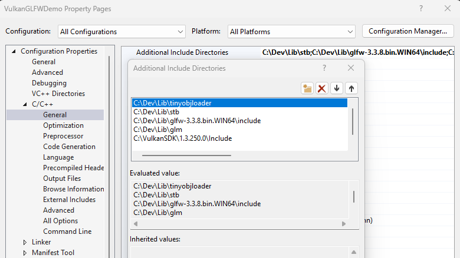

# VulkanGLFWDemo
A demo of initializing Vulkan using GLFW as the windowing framework.
This demo is created by following the tutorial at [Vulkan Tutorial](https://vulkan-tutorial.com/) by Alexander Overvoorde.

## Dependencies
- [Vulkan SDK](https://vulkan.lunarg.com/)
- [GLFW 64-bit Windows Binaries](https://www.glfw.org/download.html)
- [GLM](https://github.com/g-truc/glm)
- [stb](https://github.com/nothings/stb)

In the project properties, set the `C++->General->Additional Include Directories` and the `Linker->General->Additional Library Directories` accordingly:

